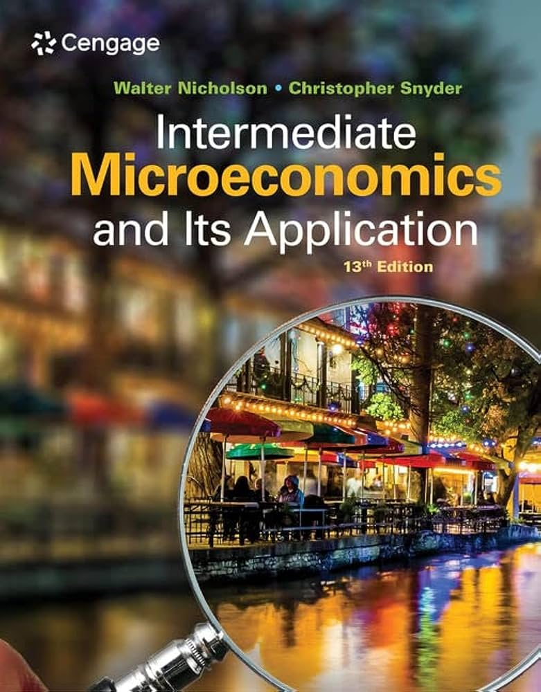
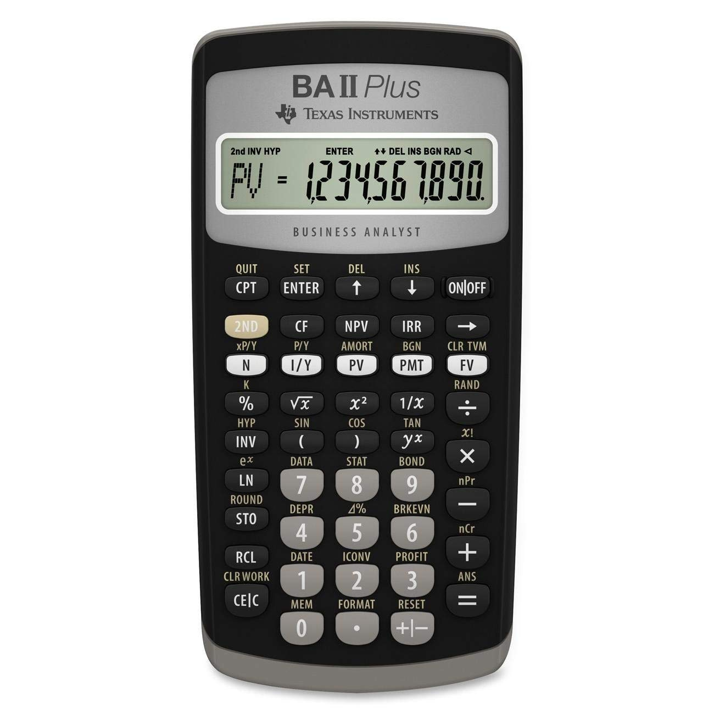
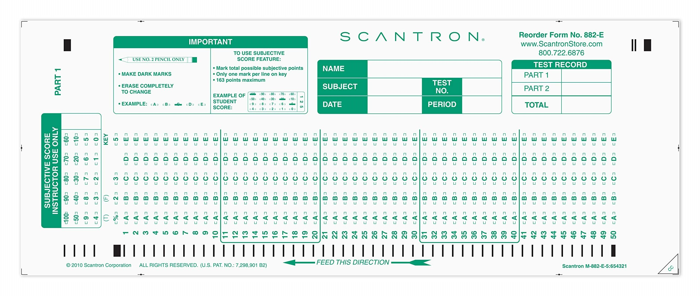

# ECON 310: Intermediate Microeconomic Theory
{: .no_toc }

## Spring 2026 Syllabus
{: .no_toc }

## Table of Contents
{: .no_toc }

- TOC
{:toc}

---

## Quick Syllabus

### Professor

- Dr. Edward Kung
- edward.kung@csun.edu

### Lectures

- Section 01: MW 10:00am - 11:15am @ Bookstein 1123
- Section 02: MW 11:30am - 12:45 pm @ Bookstein 1131

### Office Hours

- MW 12:50pm - 1:50pm @ Bookstein 4252

### Course Organization

This course meets for two 75 minute lectures a week, in person.

### Grading

- **Participation (15%)**

    You are expected to participate in class. You earn participation credit for answering questions, asking questions about the lecture, or offering thoughts and opinions when asked.
	
	- Each student can earn a maximum of 1 participation credit per lecture.
	- The first 3 participation credits during the semester are worth 5% of the final grade each.
	- Participation credits after the first 3 are worth 1% extra credit each, up to a maximum of 5.
	
	You are encouraged to participate regardless of whether you need additional credits.
	
- **Problem Sets (0%)**

    For each lecture, a problem set will be assigned. They will not be collected or graded; however, it is **strongly encouraged** that you complete these assignments as they are the best way to master the material.
	
- **Writing Assignments (25%)**

	There will occassionally be a writing assignment, usually consisting of a short essay of about 500-800 words. These assignments must be completed on Packback, an online platform for AI-assisted writing assignments.
    
- **Midterm Exams (35%)**

    There will be two midterm exams, each worth 17.5% of your grade. These will be multiple choice, in-person exams.
	
- **Final Exam (25%)**

    The final exam will be worth 25% of your grade. It will be a multiple choice, in-person exam. 

- **Grading Scale**

    |  A     |  A-   |  B+   |  B    |  B-   |  C+   |  C    |  D    |  F   |
    | ------ | ----- | ----- | ----- | ----- | ----- | ----- | ----- | ---- |
    | 100-93 | 92-90 | 89-87 | 86-83 | 82-80 | 79-77 | 76-70 | 69-60 | 59-0 |

	Your scores will be rounded up to the nearest integer. Depending on the performance of the class, a curve may or may not be applied before assigning letter grades.

---

## Tentative Schedule

| Week | Dates         | Monday                               | Wednesday                                   |  
| ---: | :------------ | :----------------------------------- | :------------------------------------------ | 
|    1 | 1/21          |                                      | Introduction                                |   
|    2 | 1/26, 1/28    | Math Review                          | Single Variable Optimization                |
|    3 | 2/2, 2/4      | A Model of Commodity Markets         | A Model of Labor Markets                    |
|    4 | 2/9, 2/11     | A General Equilibrium Model          | Application: Productivity Shocks            |
|    5 | 2/16, 2/18    | Review Session                       | **Midterm 1**                               |  
|    6 | 2/23, 2/25    | *The Calculation Problem*            | Multivariate Optimization                   |
|    7 | 3/2, 3/4      | Constrained Optimization             | Theory of Consumer Choice                   |
|    8 | 3/9, 3/11     | Consumer Choice: Applications        | Labor/Leisure Choice                        | 
|    9 | 3/16, 3/18    | **NO CLASS - SPRING BREAK**          | **NO CLASS - SPRING BREAK**                 |
|   10 | 3/23, 3/25    | Consumption and Saving               | Theory of Production                        |
|   11 | 3/30, 4/1     | Review                               | **Midterm 2**                               |
|   12 | 4/6, 4/8      | *Monetary Economics*                 | Monopolies                                  |
|   13 | 4/13, 4/15    | Price Discrimination                 | Game Theory                                 |
|   14 | 4/20, 4/22    | Imperfect Competition I              | Repeated Games                              |
|   15 | 4/27, 4/29    | Imperfect Competition II             | Risk and Insurance                          |
|   16 | 5/4, 5/6      | Adverse Selection                    | Review                                      |

Final Exam: 

- Section 01 (MW 10:00am section): TBD
- Section 02 (MW 11:30am section): TBD

---

## Course Description

### Prerequisites

Econ 160; Grade of C or better in MATH 103, MATH 150A, or MATH 255A; Completion of the lower division writing requirement.

### Course Overview

This is an intermediate level undergraduate course in microeconomic theory. You will learn about the operation of the price system in market-oriented economies. Special emphasis is placed on the mathematical modeling of consumer behavior, business behavior, market organization, production and cost, and economic welfare. You will apply the economic concepts you learn to current issues through a variety of writing assignments.

### Course Learning Outcomes

By successful completion of this course, the student should be able to:

- Write down models of supply and demand and use them to explain the functioning of the price system in competitive markets.
- Use models of consumer and firm behavior to assess the impacts of economic policies, price changes, and technological changes.
- Write down models of imperfectly competitive markets and use them to explain the impact of market power on economic welfare.
- Understand the role of risk, uncertainty, and time preference in the functioning of markets.

---

## Course Materials

**Course Website**

All of the required lecture materials are available for free and contained on this website.

**Packback (Required)**

The writing assignments in this course must be completed via [Packback](https://www.packback.co), using the link provided in Canvas. You should automatically be subscribed through **MyCSUNDigitalAccess**. If for some reason you opted out or are unsubscribed, you will need to pay for a subscription.

**Textbook (Optional)**

This course is self contained based on my own materials. If you are interested in delving deeper into the subject matter, *Intermediate Microeconomics and its Applications* by Nicholson and Snyder can serve as a helpful reference.  However, I won't be assigning any readings or problems from the textbook. 

**Calculator (Required)**

You will need a calculator for this course. Any calculator is fine.

**Scantrons (Form 882, Required)**

You will need these for exams. You can use off brand, but they need to be compatible with Scantron Form 882.

---

## Exam Policies and Information

Exams will be given in person, on paper. For exams, you should bring:

- A no. 2 pencil and eraser
- A Scantron Form 882 or compatible
- A calculator of any kind
- One sheet of paper of notes, front and back allowed (maximum size: 8"x11")
- A ruler or straight-edge
- Your CSUN ID or other photo ID showing name and picture

Other materials, including electronic devices are not allowed during exams. Violation of this policy will result in an immediate 0 on the exam.

---

## Additional Course Policies and Resources

**Communications Policy**

My preferred form of communication is in-person after class or at office hours, or by email. If you email me and I do not respond within 24 hours, do not hesitate to re-send the email. Sometimes emails get lost in the shuffle.

**Late and Missing Assignment Policy**

Requests for absences, extensions, or late submissions must be submitted by email with accompanying documentation. Only unanticipated family and medical emergencies, or other extraordinary events, will be considered valid reasons. Events that could have reasonably been anticipated, such as heavy academic workload, busy work schedule, or friends' birthday parties, will not be accepted as valid reasons.

**AI Policy**

You are allowed to use AI for any at-home assignments to help refine your writing and your thinking. However, you are not allowed to directly submit AI generated content, either in part or in whole, and **you must be able to understand and explain any material that you submit**.

If I suspect your submission of being generated by AI, you may be asked to explain your submission via oral examination. If you cannot demonstrate a level of understanding consistent with the submitted work, you will receive a penalty on the assignment (including potentially a zero) and you may be referred to Student Affairs under the academic integrity policy.

**Academic Integrity**

By taking this course, you certify that all work is your own and that you have abided by all the rules of each assignment.

Plagiarism is not allowed, and you are not allowed to have someone else do any course work in your place unless explicitly allowed by the syllabus. 

If it is discovered that you have violated academic integrity on any assignment, you may receive a grade of zero for that assignment. Repeated violations of academic integrity may result in a failing grade for the entire course or a referral to Student Affairs.

**Special Needs**

If you have a disability or need special accommodations, please register with the Disability Resources and Educational Services ([DRES](https://www.csun.edu/dres)) office or the National Center of Deafness ([NCOD](https://www.csun.edu/ncod)). If you would like to discuss your need for accommodations with me, please contact me to set up an appointment.

Special consideration may be given to students with caregiving responsibilities at home (children, disabled family members, etc.). Please get in touch with me if you need an extension and have caregiving responsibilities.

**Emergency Food and Shelter**

If you are experiencing an emergency need for food or shelter, do not hesitate to utilize the resources available to you on campus. More information: https://www.csun.edu/heart.

**University Counseling Services**

If you have need for counseling regarding any personal or academic issues, do not hesitate to reach out to the University's counseling services. More information: https://www.csun.edu/counseling/students.

**Tutoring Services**

Tutoring services may be available for this course. Please contact the Economics Department for information: https://www.csun.edu/economics.

**Diversity Statement**

It is my intent that students from diverse backgrounds and perspectives will be well served by this course, that students' learning needs will be addressed both in and out of the classroom, and that the diversity students bring to the class will be viewed as a resource, strength, and benefit. It is my intent to present materials and activities in a way that is respectful to students from all backgrounds, and that students from all backgrounds have an equal opportunity to succeed in the course. If you have any concerns, feel free to reach out to me.

**All Other Policies**

In general, the course follows all relevant CSUN policies and procedures as documented here: https://catalog.csun.edu/policies/alphabetical. Please pay special attention to the rules on **attendance** and **academic dishonesty**.

